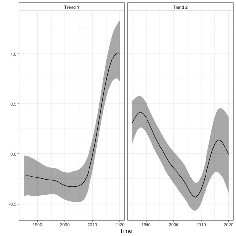
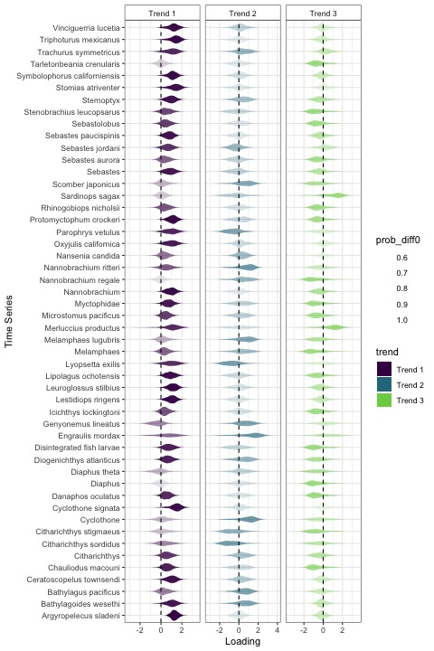
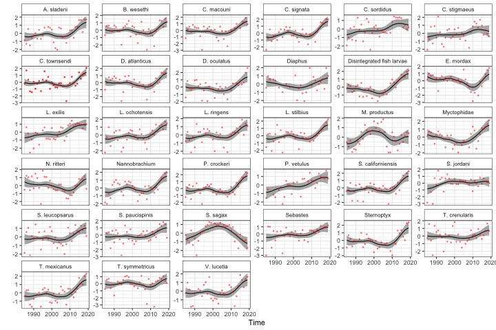

---
output:
  md_document:
    variant: gfm
---

<!-- README.md is generated from README.Rmd. Please edit that file -->

```{r, echo = FALSE}
library(knitr)
knitr::opts_chunk$set(
  collapse = TRUE,
  comment = "#>",
  fig.path = "README-figs/",
  cache.path = "README-cache/"
)
```

  <!-- badges: start -->

  [](https://github.com/ecosystem-state/calcofi-auto/actions)
  
  [](https://github.com/ecosystem-state/calcofi-auto/actions)  
  
  [](https://github.com/ecosystem-state/calcofi-auto/actions)  
  
  [](https://github.com/ecosystem-state/calcofi-auto/actions)
  <!-- badges: end -->
  
## Overview 
This repository is a demonstration of automatic index generation using data from CalCOFI and ERDDAP. The index is generated by applying Dynamic Factor Analysis (DFA) to the top ~ 50 species, using spring samples collected 1985 - present.

## Results

We find that a model with 3 trends has better predictive accuracy than a model with 1-2 trends. 

```{r echo=FALSE, fig.cap="Estimated trends for the CalCOFI community"}
# All defaults

```

```{r echo=FALSE, fig.cap="Estimated loadings for the CalCOFI community"}
# All defaults

```

```{r echo=FALSE, width = 8, fig.cap="Predicted and observed fits to the CalCOFI data"}
# All defaults

```

## bayesdfa

For more on the approach used, check out the [bayesdfa R package](https://fate-ewi.github.io/bayesdfa/)
