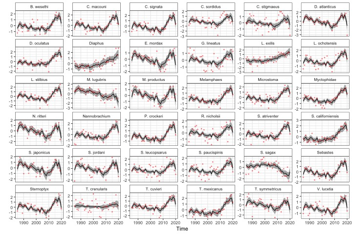

<!-- README.md is generated from README.Rmd. Please edit that file -->

<!-- badges: start -->

<!-- badges: end -->

## Overview

This repository is a demonstration of automatic index generation using
data from CalCOFI and ERDDAP. The index is generated by applying Dynamic
Factor Analysis (DFA) to the top \~ 50 species, using spring samples
collected 1985 - present.

If you’re looking for data:  
\* time series (with uncertainty) are in
[indices/predicted_indices_sdmtmb.rds](https://github.com/ecosystem-state/calcofi-auto/blob/main/indices/predicted_indices_sdmtmb.rds)  
\* the prediction grid is in [indices/pred_grid.rds](https://github.com/ecosystem-state/calcofi-auto/blob/main/indices/pred_grid.rds)  
\* estimated DFA trends are in [data/index_data.rds](https://github.com/ecosystem-state/calcofi-auto/blob/main/data/index_data.rds)

## Results

We find that a model with 3 trends has better predictive accuracy than a
model with 1-2 trends.

## bayesdfa

For more on the approach used, check out the [bayesdfa R
package](https://fate-ewi.github.io/bayesdfa/)
