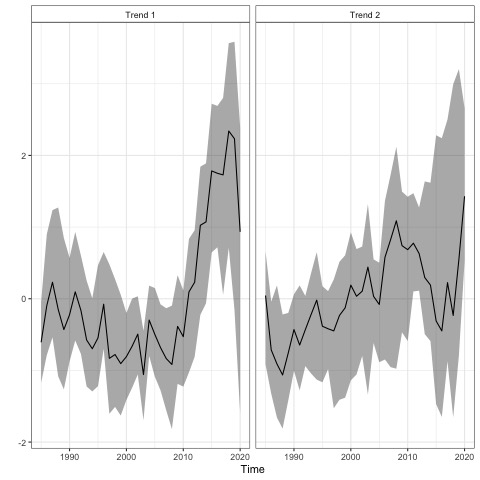
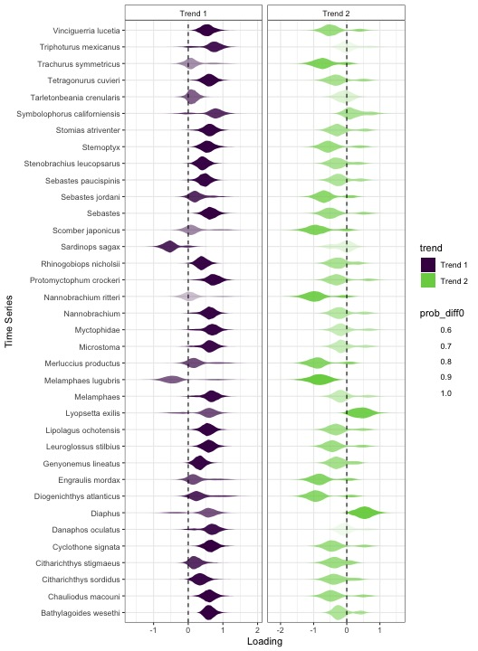

<!-- README.md is generated from README.Rmd. Please edit that file -->

<!-- badges: start -->

<!-- badges: end -->

## Overview

This repository is a demonstration of automatic index generation using
data from CalCOFI and ERDDAP. The index is generated by applying Dynamic
Factor Analysis (DFA) to the top \~ 50 species, using spring samples
collected 1985 - present.

## Results

We find that a model with 3 trends has better predictive accuracy than a
model with 1-2 trends.

Estimated trends for the CalCOFI community

Estimated loadings for the CalCOFI community

Predicted and observed fits to the CalCOFI data

## bayesdfa

For more on the approach used, check out the [bayesdfa R
package](https://fate-ewi.github.io/bayesdfa/)
